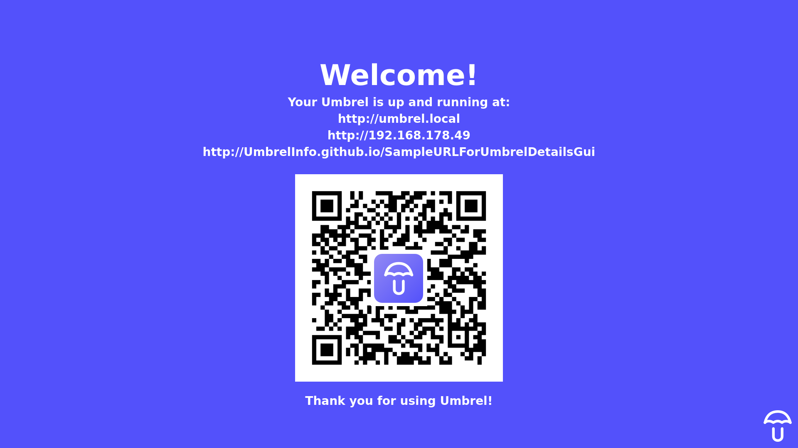

# GUI for Umbrel details



A gui version of umbrel-details. Only works on Raspberry Pis.

## Required packages to run this:

```
sudo apt install libqt5gui5 libqt5svg5 libqt5network5 -y
```

## Build

```
mkdir build
cd build
cmake ..
make -j$(nproc)
```

## Running

To run this on an Raspberry Pi with Umbrel OS, run
```
export QT_QPA_EGLFS_HIDECURSOR=1
./umbrel-details -platform eglfs
```

## License

The umbrel logo is Copyright 2020 Umbrel and is licensed under the terms and conditions of the MIT License.